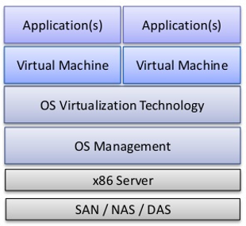
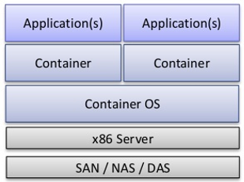
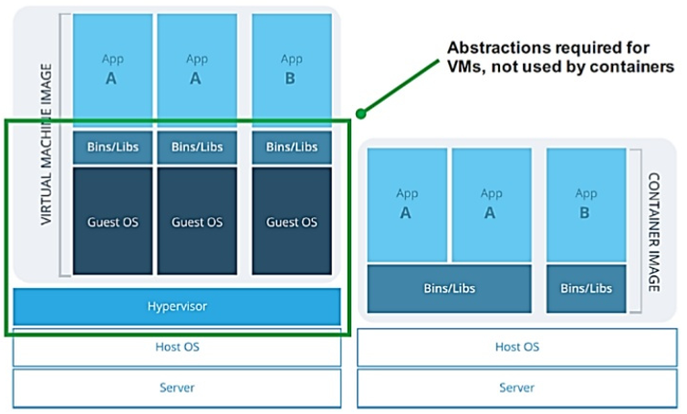
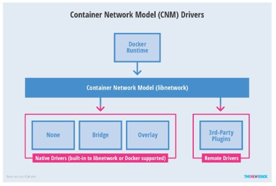
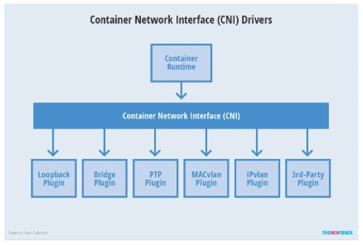
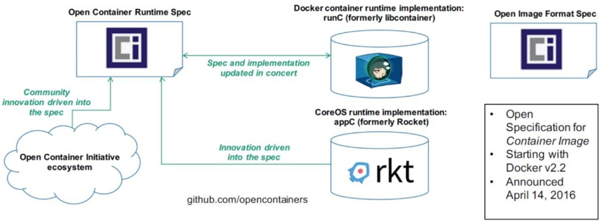
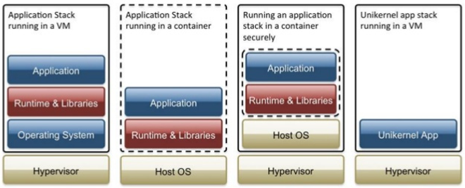
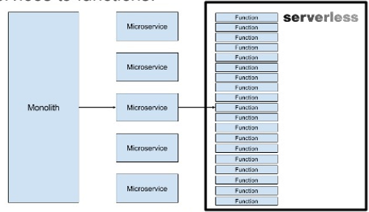
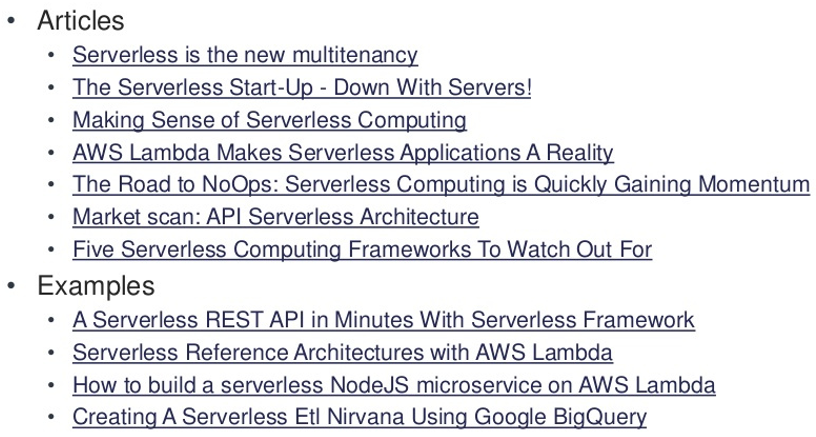

+++
title = "从虚拟机到容器再到函数计算"
date = 2019-09-26T07:48:37+08:00
draft = false

# Tags and categories
# For example, use `tags = []` for no tags, or the form `tags = ["A Tag", "Another Tag"]` for one or more tags.
tags = ["ARCHITECTURE"]
categories = []

# Featured image
# To use, add an image named `featured.jpg/png` to your page's folder. 
[image]
  # Caption (optional)
  caption = ""

  # Focal point (optional)
  # Options: Smart, Center, TopLeft, Top, TopRight, Left, Right, BottomLeft, Bottom, BottomRight
  focal_point = ""
+++


昨天看到AWS STEP FUNCTIONS支持嵌套的工作流

https://aws.amazon.com/about-aws/whats-new/2019/08/aws-step-function-adds-support-for-nested-workflows/

，当时就被震惊了。 AWS早些年推出SWF框架提供工作流服务，

后来工作流服务就没有大的工作，SWF框架的核心开发者一部分

离职去了UBER开发Cadence。没想到沉寂了多年的AWS会在STEP FUNCTIONS

支持工作流，看来这个千亿规模的市场又快被颠覆了。

20对年来，工作流都是超大型企业的配置专利，而STEP function的推出

可以预计，高大上的工作流服务会很快走进很多中小企业工作台并被普及应用。

回顾一下自己的工作历史：

从以前的数据中心服务器SA(2006), 到虚拟主机ESX，

再到OPENSTACK(2010)搭建混合云，

然后利用K8S(2014)搭建PaaS，现在SERVERLESS,

计算架构正在发生快速的演进。本文梳理了算力演进历史和未来


内容

- 从虚拟主机到容器

- 从容器到unikernel

- 函数计算的蓬勃发展


# 什么是虚拟计算



# hypervisor分类

- Type-1 裸机

KVM, QEMU, VMWare, Virtualbox

- Type-2 托管

XenServer， Hyper-v， KVM, ESX, Xen


# 虚拟机的问题

- 贵

一台云主机(8G/4Core/500MBps)在2017年的超过6000元/年

- 操作慢

一个普通的镜像在2G左右，再加上JAVA应用，一个镜像需要10G.

启动，备份非常不便。

# 容器计算



|虚拟机|            容器
|:---|:---|:---|
构件|  完整的操作系统和应用|  微内核和应用
虚拟技术|  硬件虚拟化|  操作系统虚拟化




# 容器计算带来什么好处

- 容器镜像小

alpine的容量是2M

- 容器占用的硬件资源更少

一台PC可以启动上百个容器

- 容器启动快

一般几毫秒可以启动

- 容器不用备份

容器创建只需要一个Dockerfile，容器镜像是只读镜像

- 容器和微服务器架构，DevOps, CI/CD天然融合

# 容器存在的问题

- 安全

容器共享操作系统内核，具体较低的隔离级别，

如果内核出问题，其他的容器也会处于风险之中

- 网络

如何在足够的隔离级别和复杂的高效网络连接权衡


# 容器编排

- K8S

- EKS

- SWARM

- MARATHON

- MAGNM

- FLEET

用户轻松在计算集群里面部署，管理，扩展基于容器的应用而

不用关心容器和服务器的绑定，系统扩容等问题

# 容器网络

- CNM

DOCKER规范，libnetwork实现

内置的驱动包括none, host, bridge , overlay, MACvlan

```
$ docker network ls
 NAME                 DRIVER              SCOPE
68343147e103        bridge               bridge              local
5d7df1d8f633        docker_default       bridge              local
d3990aab14a9        host                 host                local
fe4ec77439f4        none                 null                local
```



- CNI

COREOS规范，被K8S, MESOS, CLOUD Foundry采用 

json格式的网络模式定义




# docker的核心组件

- LXC

- AUFS


# DOCKER的优势

- 镜像不可修改

- 部署没有第三方依赖

- 注册器简单且容易扩展

- 容易回滚

对DOCKER的误解：

- 如果学习了docker就不必学其他的系统知识了

- 每个容器只能有一个进程

- 用容器了就不必使用其他的配置管理工具了

- 必须使用容器才能达到高效敏捷和一致性状态优势

# Open Containers Initiative



# UniKernel



# 函数计算的兴起


**No server is easier to manage than no-server**

背景：

- 前端技术演进

1. 强大的原生客户/移动客户端让开发者通过调用各种云服务

编写大规模互联网应用，替换传统的后台服务

2. HTTP/S应用接口及基于token的安全认证成为工业标准

- 后台的定制化开发

基于云服务器定制开发

# ServerLess  VS  PaaS

PasS可能是ServerLess的一个迭代






