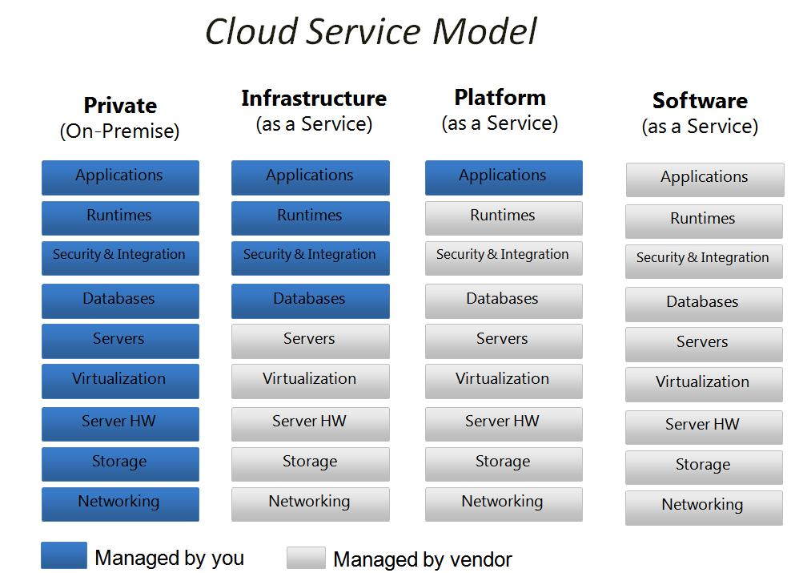

+++
title = "面向应用的无服务器架构"
date = 2018-10-21T23:34:49+08:00
draft = false

# Tags and categories
# For example, use `tags = []` for no tags, or the form `tags = ["A Tag", "Another Tag"]` for one or more tags.
tags = ["PAAS"]
categories = []

# Featured image
# To use, add an image named `featured.jpg/png` to your page's folder. 
[image]
  # Caption (optional)
  caption = ""

  # Focal point (optional)
  # Options: Smart, Center, TopLeft, Top, TopRight, Left, Right, BottomLeft, Bottom, BottomRight
  focal_point = ""
+++

根据多年在IAAS/PAAS平台的建议经验，并帮助多个行业例如医疗，电信，
建筑行业客户向互联网IAAS/PAAS平台的迁移，在这里做一些直观的分享，
希望能为中小企业上云提供一些有价值的建议。

**本帖中部分建议只是针对没有自己数据中心的中小企业，如果已经拥有自己的数据中心，
需要根据目前的计算能力选择相应的云服务厂商**

云服务模型

从云服务模型可以看出，企业上云有以下路径可选。
但导向是一致的，专注业务，IT外包。

- 从自建数据中心向IaaS平台迁移
- 从IaaS平台向PaaS迁移
- 在公有云厂家间迁移
- 从IaaS平台向FaaS迁移

上云的初级阶段:
购买云主机， 购买云主机的性价比指标和物理主机的指标完全不同，
如何选择最高性价比的云主机，参考

[云主机主要性价比指标](/post/iaas-how-to-buy-ec2/)

硬盘转速的指标对云主机不再适用，云主机的性价比指标主要有以下几个：

- 云主机内网/外网平均带宽(最核心指标)
- 存储(网络硬盘)IO吞吐量
- 初始化完成后首次资源利用率

[国内外云厂商主要产品基准测试对比图](/post/iaas-benchmark-2016/)

[上云注意事项](/post/iaas-gears)

上云的中级阶段：PaaS

[如何选择PAAS供应商](/post/paas-how-to-buy)

上云的终级阶段: 不需要服务器。

[如何选择FAAS供应商](/post/faas-how-to-buy)

